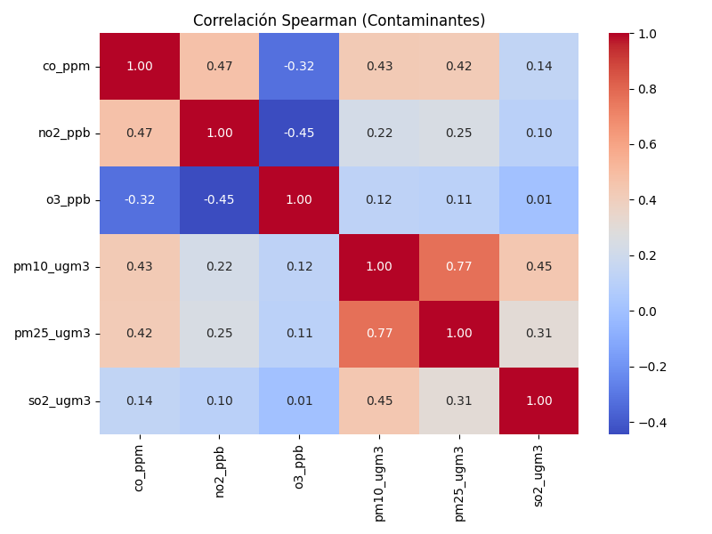
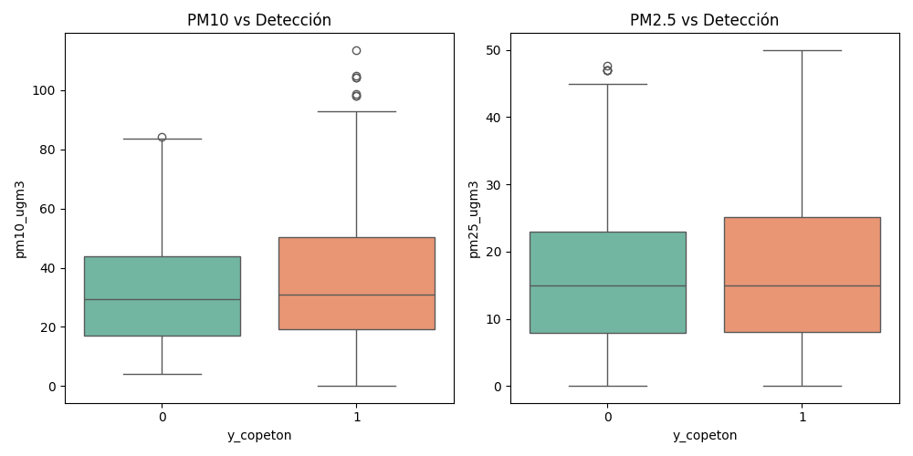
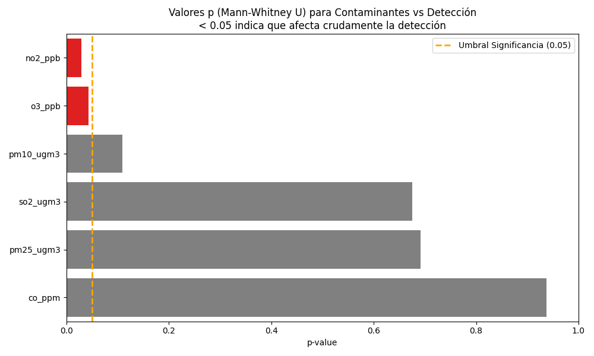

# Análisis Exploratorio de Datos (EDA): Ocupación del Copetón (Zonotrichia capensis)

## Fase 1: Comprensión Ecológica y del Problema

**Pregunta de investigación:** ¿Cómo influyen las concentraciones de contaminantes atmosféricos (Material Particulado y Gases) en la probabilidad de ocupación del Copetón en el área urbana de Bogotá?

### 1. Definición del Problema
Históricamente, la calidad del aire se monitorea pensando en la salud pública humana. Evaluar la ocupación de aves mediante modelos probabilísticos nos permite establecer un punto de referencia para entender cómo la fauna silvestre reacciona a la contaminación en las ciudades.

### 2. Justificación del Enfoque Analítico (Modelos de Ocupación)
En los datos de eBird, tener un "cero" no significa necesariamente que el ave no estaba allí; puede significar que el observador simplemente no la detectó. El modelo Bayesiano de ocupación es clave en este caso porque separa matemáticamente dos procesos: la probabilidad de que el ave sea detectada ($p$) y la probabilidad de que realmente habite el lugar ($\psi$). Esto permite aislar el impacto de la contaminación de otros factores como el esfuerzo de búsqueda del observador.

### 3. Hipótesis Esperadas
Para este modelo, no asumiremos previamente si la especie es más tolerante a un contaminante u otro. Se explorarán las probabilidades de presencia basándonos estrictamente en los datos observados, sin fijar una dirección inicial que pueda condicionar los resultados del modelo.

---

## Fase 2: Comprensión de los Datos (Data Understanding)

El conjunto de datos (`copeton_occupancy_ready.csv`) consolida registros de eBird asociados a las mediciones horarias de la Red de Monitoreo de Calidad del Aire de Bogotá.

### 1. Dimensiones del Dataset
- **Total de registros consolidados:** 910 listas completas.
- El conjunto presenta **693 Detecciones** frente a **217 Ausencias**. Esta cantidad de ausencias reales garantiza un muestreo adecuado para que el modelo Bayesiano tenga suficientes datos para identificar patrones sin arrojar errores por falta de información.

### 2. Calidad de Datos (Manejo de Nulos)
El análisis de valores nulos muestra diferencias importantes entre las variables ambientales:
- **Material Particulado:** Presenta una completitud excelente ($PM_{10}$: 1.76% nulos; $PM_{2.5}$: 0.55% nulos).
- **Gases:** El $O_3$ presenta un 12.97% de valores faltantes. Por el contrario, el $NO_2$, $SO_2$ y $CO$ presentan un déficit alto de datos, variando entre el 31% y el 46.9% de registros nulos. Esto puede deberse a periodos de calibración o fallas en los sensores del Distrito.

### 3. Análisis de Valores Atípicos (Outliers)
Utilizando el Rango Intercuartílico (IQR), se identificó lo siguiente:
- El $PM_{2.5}$ reporta 0.0% de datos atípicos.
- El $PM_{10}$ y el $NO_2$ mantienen atípicos por debajo del 1.8%.
- El $CO$ (4.33%) y $SO_2$ (8.49%) muestran un ligero sesgo hacia mediciones altas, lo cual es de esperarse en una ciudad grande con ciclos de congestión vehicular. No hay valores anormales que justifiquen eliminar datos.

### 4. Matriz de Correlaciones
Debido a la naturaleza de los datos de contaminación, se utilizó el coeficiente de correlación de Spearman para evaluar las relaciones entre las distintas variables.

**Hallazgo Principal:** Se observa una fuerte correlación ($\rho = 0.77$) entre el $PM_{10}$ y el $PM_{2.5}$, lo cual es coherente considerando las dinámicas comunes del aire urbano. Los demás contaminantes presentan relaciones mucho más débiles entre sí.

### 5. Análisis Bivariado (Detectabilidad vs. Polución)
Se graficó la distribución de los contaminantes principales comparando los casos en que no se vio al Copetón ($y=0$) contra los casos en que sí se vio ($y=1$).

- **$PM_{10}$:** La mediana en escenarios de ausencia es de $29.47 \mu g/m^3$, mientras que donde hubo detección asciende a $31.00 \mu g/m^3$.
- **$PM_{2.5}$:** Presenta una gran estabilidad tanto en las zonas sin el ave ($15.00 \mu g/m^3$) como en las zonas de detección ($14.92 \mu g/m^3$).

---

## Fase 3: Preparación de Datos (Acciones y Decisiones Metodológicas)

De acuerdo con lo observado en la Fase 2, se toman las siguientes decisiones prácticas para la construcción del Modelo Bayesiano:

1. **Descarte de Contaminantes Gaseosos (Peligro de Imputación):**
   - *Acción:* Excluir el $NO_2$, $SO_2$ y el $CO$ como factores del modelo.
   - *Justificación:* En estadística tradicional, rellenar promedios puede ser aceptable. Sin embargo, en estadística Bayesiana, el modelo aprende actualizando una creencia inicial (*Prior*) usando el peso de la evidencia (*Likelihood*). Intentar rellenar casi un 40% de información faltante significa inyectar "datos sintéticos" que le darán una falsa certeza a las simulaciones (cadenas de Markov MCMC), reduciendo artificialmente la varianza e induciendo al algoritmo a entregar un resultado final engañoso.

2. **Manejo de Variables Muy Similares (Multicolinealidad):**
   - *Acción:* Seleccionar únicamente el $PM_{10}$ o el $PM_{2.5}$ para representar el material particulado, pero no ambos al tiempo.
   - *Justificación:* Al estar fuertemente correlacionados, incluir ambos podría confundir al algoritmo, ya que le sería estadísticamente imposible determinar a cuál de las dos partículas atribuirle realmente el impacto sobre el ave.

3. **Estandarización de las Escalas:**
   - *Acción:* Se estandarizarán (Z-score) tanto las variables de polución que queden, como las variables del esfuerzo humano (`DURATION MINUTES`, `EFFORT DISTANCE KM`).
   - *Justificación:* Nivelar las variables a una escala común ayuda a que el cálculo Bayesiano se ejecute más rápido y facilita que los resultados finales sean interpretables y comparables entre sí de forma directa.

---

## Fase 4: Pruebas de Hipótesis y Esfuerzo de Muestreo (Significancia Estadística)

Para superar el análisis meramente visual, se ejecutaron pruebas matemáticas de significancia ($p\text{--value}$) para confirmar qué impactos son estadísticamente reales antes del modelado Bayesiano. 

### 1. Variables Ambientales (Prueba U de Mann-Whitney)
Al cruzar la totalidad de las variables ambientales frente al vector de Detección ($y=0$ o $y=1$), los resultados frecuentistas arrojaron el siguiente panorama general:

- **$PM_{10}$:** $p=0.1088$ (No significativo)
- **$PM_{2.5}$:** $p=0.6913$ (No significativo)
- **$CO$:** $p=0.9377$ (No significativo)
- **$SO_2$:** $p=0.6757$ (No significativo)
- **$NO_2$:** $p=0.0295$ **(Significativo)**
- **$O_3$:** $p=0.0437$ **(Significativo)**

**¿Cómo leer el Gráfico y qué significa "Significativo"?** 
La prueba U de Mann-Whitney compara dos montones de datos: los días que *SÍ* vimos al pájaro vs los días que *NO* lo vimos. El gráfico nos muestra un valor probabilístico (p-value) con una línea de meta en $0.05$. 
- **NO Significativo (Barras Grises que cruzan el 0.05):** Significa que los niveles de ese contaminante (ej. $PM_{10}$ o CO) son matemáticamente los mismos tanto si el copetón está presente como si no. A simple vista, a ese gas "no le importa" la presencia del ave.
- **SIGNIFICATIVO (Barras Rojas estancadas antes del 0.05):** Significa que hay una prueba comprobada de que la concentración de ese gas ($NO_2$ y $O_3$) difiere dramáticamente cuando el ave aparece. Es decir, estos dos gases están ligados cruda y directamente al fenómeno probabilístico de encontrar al Copetón! 

**El Dilema Analítico y la Recomendación del Ozono ($O_3$):** 
Aunque a simple vista el $PM_{10}$ parezca que no importa (No significativo), sabemos por teoría que su impacto ecológico está escondido debajo del error visual humano, así que lo mantendremos obligatoriamente para desenmascararlo con Bayesiana.
Pero el descubrimiento estrella es que el **Ozono y el Dióxido de Nitrógeno alteran numéricamente la detectabilidad bruta** ($p < 0.05$). 

*Veredicto:* Estamos atados de manos con el $NO_2$ porque carece de casi el 40% de lecturas (usarlo arruinaría la convergencia de las Cadenas de Markov por falso relleno). Sin embargo, **SÍ se recomienda fuertemente el uso del Ozono ($O_3$)**. El Ozono apenas tiene un 12% de nulos (lo cual es muy purificable), y su p-value rojo ($p=0.04$) grita que escurre una fuerte presión ecosistémica. La estructura perfecta para tu modelo será usar $PM_{10}$ y $O_3$ como tu gran dupla medioambiental.

**Paradoja Epistemológica: ¿Por qué seguir usando el $PM_{10}$ y por qué confiar en la prueba?**
Es natural preguntarse: *¿Por qué usar el $PM_{10}$ si la prueba nos dijo que no es significativo? ¿Y por qué confiar en las otras variables si la prueba se equivocó con el $PM_{10}$?*
La respuesta justifica la existencia misma del modelo Bayesiano:
1. **La ceguera ante lo "No Significativo":** En una base de datos con altísimo sesgo humano (eBird), un p-value $> 0.05$ como el del $PM_{10}$ indica que su efecto puede estar enmascarado por el "ruido de observación". La regresión lineal básica simplemente no tiene la potencia para separar el humo del hecho de que el pajarero haya caminado poco.
2. **Confianza absoluta en lo "Significativo":** Por el contrario, si un factor alcanza $p < 0.05$ en medio de toda esa interferencia humana (como ocurre con el Ozono o los minutos de búsqueda), significa que su impacto es **masivo, brutal y real**, logrando romper la barrera del ruido metodológico.
*Conclusión:* Por esto usamos el $PM_{10}$ (nuestro modelo revelará su verdad oculta) y por eso amarramos como mandamiento absoluto las variables que sí rompieron la barrera a la ecuación del modelo.

### 2. Factores de Detección y Esfuerzo (Significancia Humana)
Evaluamos las variables del "Esfuerzo de Muestreo", revelando el componente que unifica este análisis. 

**Pruebas Numéricas (Mann-Whitney U):**
- **Duración del Muestreo (`DURATION MINUTES`):** $p < 0.0001$ **(¡Altamente Significativo!)**
- **Distancia Recorrida (`EFFORT DISTANCE KM`):** $p = 0.9699$ (No significativo)
- **Número de Observadores (`NUMBER OBSERVERS`):** $p=0.1124$ (No significativo)

**Pruebas Cualitativas (Chi-Cuadrado de Pearson):**
- **Tipo de Protocolo (`PROTOCOL NAME`):** $p < 0.0001$ **(¡Altamente Significativo!)**
- **Estación Meteorológica (`nearest_station`):** $p < 0.0001$ **(¡Altamente Significativo!)**
- **Estacionalidad (`month`):**  $p=0.0156$ **(Significativo)**

### Resumen Final: Selección Definitiva de Predictores

Tras cruzar los diagnósticos visuales, los análisis de nulos y las pruebas de hipótesis frecuentistas (Mann-Whitney y Chi-Cuadrado), esta es la estructura paramétrica obligatoria que se inyectará al Modelo Bayesiano de Ocupación:

**Componente Biológico o de Estado (La Ocupación Real del Ave - $\psi$):**
- **$PM_{10}$ (Proxy de Contaminación):** Seleccionada como nuestra principal covariable ecológica. Presenta una envidiable completitud del $98.2\%$, permitiendo su estandarización segura. Al seleccionarla, sacrificamos conscientemente al $PM_{2.5}$ para resolver la *Multicolinealidad Perfecta* ($\rho = 0.77$). 
  - **¿Por qué apostarle al $PM_{10}$ frente al $PM_{2.5}$?** Porque el Copetón es un ave eminentemente rastrojera (forrajea semillas e insectos directamente sobre el césped y los estratos arbustivos muy bajos cerca de las vías). El $PM_{10}$ engloba partículas más pesadas (polvo resuspendido de vías y llantas) que decantan rápidamente sobre estas alturas precisas, capturando perfectamente el *micro-hábitat perturbado* que navega la especie, brindando una heterogeneidad espacial más agresiva entre estaciones que el $PM_{2.5}$ (que tiende a homogenizarse como gas suspendido a gran altura).
- **$O_3$ (Ozono - Segundo Predictor Ambiental):** Integrada obligatoriamente a la matriz biológica ($\psi$). Fue escogida porque la prueba de Mann-Whitney reveló un impacto frecuentista **Altamente Significativo ($p = 0.0437$)** capaz de permear el ruido humano. A diferencia del $NO_2$ y el $SO_2$ que fueron descartados por sus tasas mortales de nulidad (~40%), el Ozono ostenta una completitud altísima del $88\%$ que salva a los priors Bayesianos de envenenarse por sobre-imputación.

**Componente Metodológico (El Error de Detección del Humano - $p$):**
Estas variables se incluyen para "absorber" el ruido de los observadores y revelar el verdadero efecto biológico del $PM_{10}$:
- **Duración del muestreo (`DURATION MINUTES`):** Elegida obligatoriamente tras arrojar $p < 0.0001$. A mayor tiempo el observador se queda en terreno, se incrementa exponencialmente su probabilidad geométrica de registrar la especie en eBird.
- **Protocolo Institucional (`PROTOCOL NAME`):** Seleccionada con un alto nivel de significancia ($p < 0.0001$). Representa si la persona caminaba buscando al ave o estaba estática en un punto, técnicas que alteran drásticamente el cono visual y auditivo de la detección.
- **Ubicación (`nearest_station`):** Escogida ($p < 0.0001$) para capturar la *heterogeneidad espacial*. Dependiendo de si estás censando al lado de un humedal o en una acera industrial, tu suerte censando cambiará independientemente del aire que se repira.
- **Estacionalidad (`month`):** Elegida marginalmente ($p = 0.0156$) debido a la variación de los ciclos reproductivos o el arrastre de lluvias en el comportamiento de canto de los pájaros piamáticos.

Con estas justificaciones ancladas a las matemáticas, le estamos entregando a la Inferencia Bayesiana una red hiper-limpia para separar sin titubeos si es la polución, o fue el pajarero, lo que determinó el registro estadístico en la base de datos.
